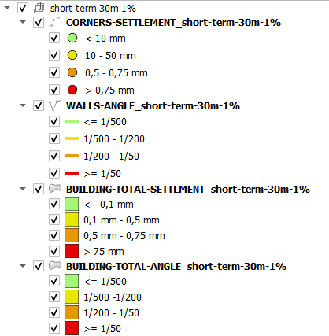
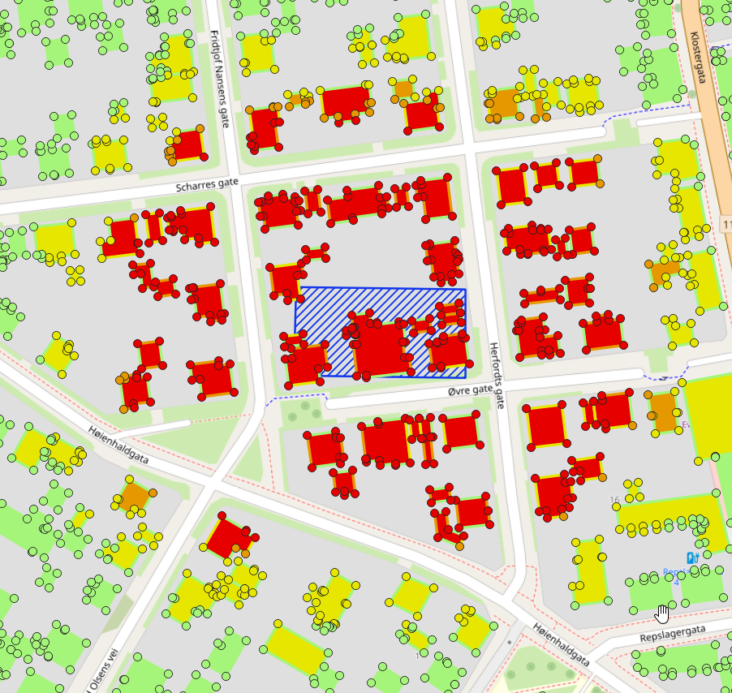
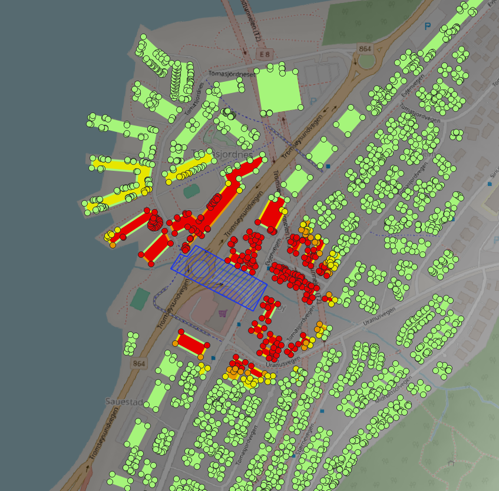
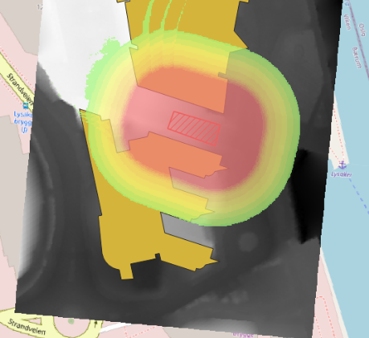

# Geovita Processing Provider

A QGIS plugin repository for different Geovita custom processing algorithms. This plugin is currently under development, so new features may be expected!

**New algorithms are added to this repo as they are developed, and new releases published!**

QGIS Plugin
===========

This provider functions as a QGIS plugin (for QGIS >= 3.28) and is available via the standard QGIS plugins repository, so you can install it directly from within QGIS itself.

The plugin adds a new group to the Processing Toolbox for "Geovita", containing sub-groups with tools and algorithms to perform different tasks.

If you enconter bugs of any sort, PLEASE consider reporting them through [the bugtracker at GitHub](https://github.com/danpejobo/geovita_processing_plugin/issues). Everyone benefits!

## Example results from the REMEDY GIS RiskTool
The following images show some example results. Both the excavation and the tunnel algorithm produces results for short and/or longterm settlements, but uses different calculation methods. The impact map calculates and illustrate total settlements in the impaced soil around the excavation.

| Loaded Layers | Short term | Long term | Impact map |
|---------------|------------|-----------|------------|
|     The symbology of the loaded layers |     Blue hatch is the excavation. Status of corners, walls and buildings |     Blue hatch is the excavation. Dark background is the depth to bedrock raster used for long term settlements. |     Red hatch is the excavation. The impact map for total settlements around the excavation. |
