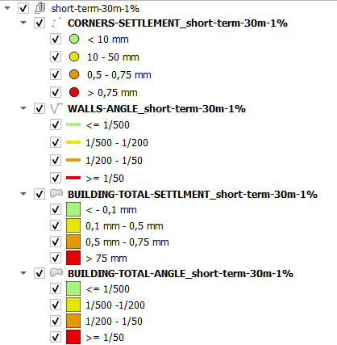
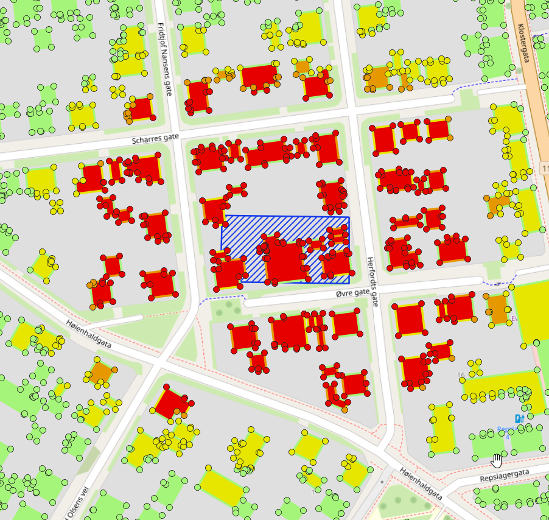
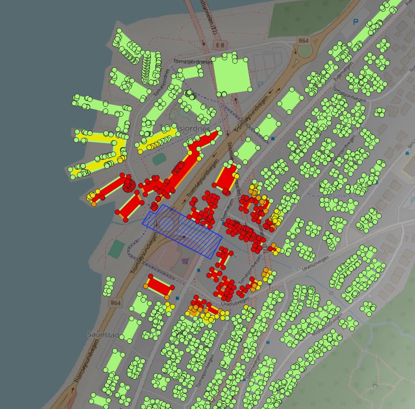
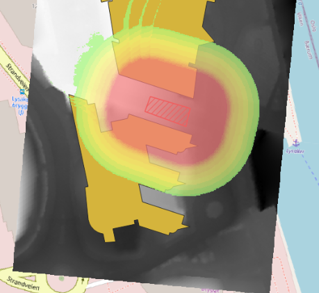

Geovita Processing Provider
===========================

The Geovita processing provider for QGIS!

**New algorithms are added to the provider as they are developed**

QGIS Plugin
===========

This provider functions as a QGIS plugin (for QGIS >= 3.28) and is available via the standard QGIS plugins repository, so you can install it directly from within QGIS itself.

The plugin adds a new group to the Processing Toolbox for "Geovita", containing sub-groups with tools and algorithms to perform different tasks.

If you enconter bugs of any sort, PLEASE consider reporting them through [the bugtracker at GitHub](https://github.com/danpejobo/geovita_processing_plugin/issues). Everyone benefits!

Check it out [here!](/geovita_processing_plugin/)

Overview
========
### REMEDY GIS RiskTool-subgroup
  
  - [REMEDY_GIS_RiskTool](https://github.com/norwegian-geotechnical-institute/REMEDY_GIS_RiskTool) is an open-source GIS-based tool using the GIBV method to quantify building damage risks from deep excavation, analyzing settlements due to wall deformation and groundwater drawdown, developed under the REMEDY/Begrens Skade 2 research project (2017–2022).

## Example results from the REMEDY GIS RiskTool
The following images show some example results. Both the excavation and the tunnel algorithm produces results for short and/or longterm settlements, but uses different calculation methods. The impact map calculates and illustrate total settlements in the impaced soil around the excavation.

| Loaded Layers | Short term | Long term | Impact map |
|---------------|------------|-----------|------------|
|     The symbology of the loaded layers |     Blue hatch is the excavation. Status of corners, walls and buildings |     Blue hatch is the excavation. Dark background is the depth to bedrock raster used for long term settlements. |     Red hatch is the excavation. The impact map for total settlements around the excavation. |

---

### Geovita-subgroup

#### Create Atlas Coverage
This algorithm automates the creation of a coverage layer for use with the QGIS Atlas feature, which is ideal for generating multi-page "strip maps" along a route (like a road or tunnel).

The tool takes a single line (e.g., a road centerline), your desired map scale, and your paper dimensions to generate two key output layers:

   - Atlas Points: A point layer where each point represents the center of a map sheet. This layer contains a crucial angle field, which is automatically calculated to ensure the "long axis" of your paper is aligned with the road.

   - Atlas Coverage Polygons: A polygon layer that shows the footprint (the exact rectangular coverage) of each map sheet. This is perfect for creating an index or key map.

